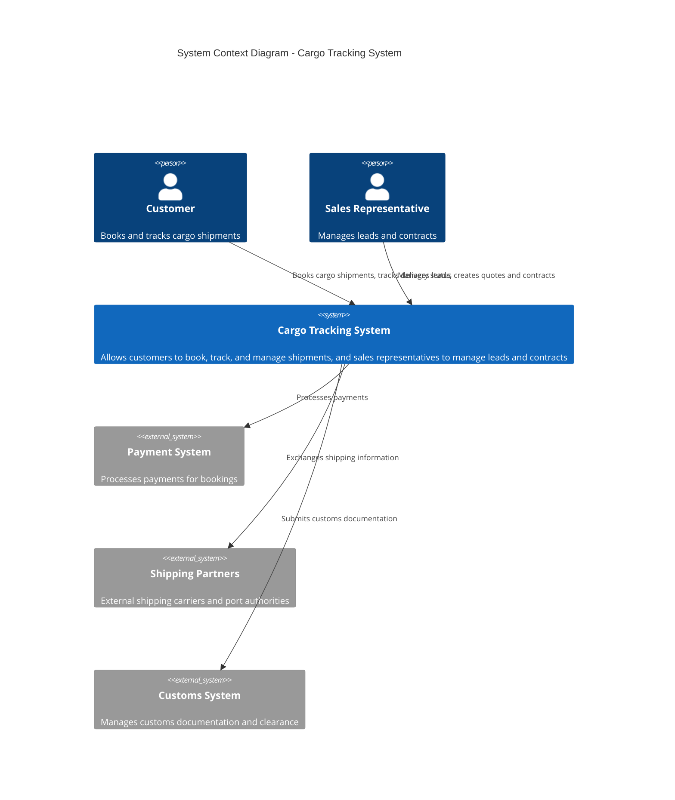
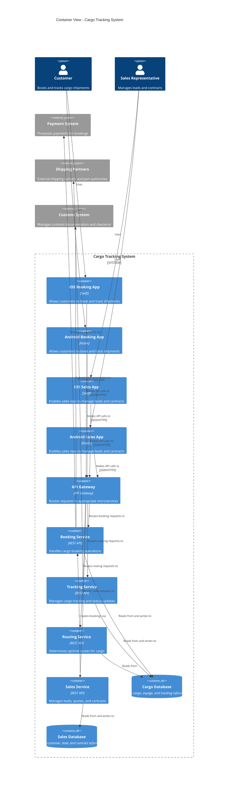
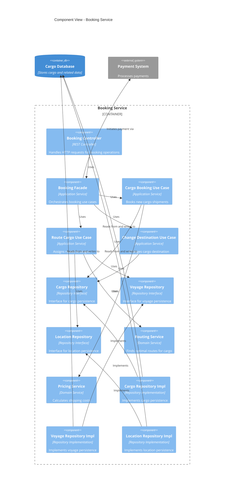

# Cargo Tracking System - Domain Model

## System Purpose

The Cargo Tracking System is a comprehensive logistics management platform designed to streamline and optimize the process of shipping cargo across global supply chains. It enables customers to book, track, and manage their shipments through intuitive mobile applications, while providing sales representatives with tools to manage customer relationships, generate quotes, and create shipping contracts. The system addresses the complex challenges of international shipping including route optimization, customs compliance, and real-time cargo tracking.

Built on Domain-Driven Design principles, the system establishes a shared language between business and technology stakeholders, ensuring that the software accurately reflects the realities and constraints of the shipping industry. This model serves as the foundation for both the customer-facing booking applications and the internal sales management system, connected through a unified backend architecture.

## Overview

This document outlines the domain model for a cargo shipping system based on principles from Domain-Driven Design (Eric Evans) and Clean Architecture (Robert C. Martin). The model supports both a booking application and sales management system available as native mobile applications on Android and iOS platforms, with a RESTful backend API.

## Table of Contents

- [System Context](#system-context)
- [Container View](#container-view)
- [Component View](#component-view)
- [Domain Model](#domain-model)
  - [Core Entities](#core-entities)
  - [Entity Properties](#entity-properties)
  - [Value Objects](#value-objects)
  - [Entity Relationships](#entity-relationships)
  - [Domain Services](#domain-services)

## System Context

## Container View

## Component View

## Domain Model

### Core Entities

- **Cargo**: Primary aggregate root in the shipping domain, representing goods being transported
- **Itinerary**: Represents the complete route a cargo will take
- **Location**: Represents ports, terminals, and other locations in the shipping network
- **Voyage**: Represents a ship's journey with a schedule
- **Customer**: Person or organization that books cargo shipments
- **Booking**: Represents the reservation of space on voyages for a cargo
- **Handling Event**: Records cargo handling activities (loading, unloading, customs, etc.)
- **Sales Contract**: Agreement between shipping company and customer
- **Sales Lead**: Potential customer in the sales pipeline
- **Quote**: Price offering for a specific cargo shipment scenario

### Entity Properties

#### Cargo (Entity, Aggregate Root)
- **Properties:**
  - trackingId (Identity, Value Object)
  - origin (Location reference)
  - routeSpecification (Value Object)
  - itinerary (Entity)
  - deliverySpecification (Value Object)
  - deliveryProgress (Value Object)

#### Itinerary (Entity)
- **Properties:**
  - itineraryId (Identity)
  - legs (Collection of Leg)

#### Location (Entity)
- **Properties:**
  - locationCode (Identity, Value Object)
  - name (String)
  - address (Address)
  - portFacilities (Collection of Enum)

#### Voyage (Entity, Aggregate Root)
- **Properties:**
  - voyageNumber (Identity, Value Object)
  - schedule (Schedule)
  - carrierMovements (Collection of CarrierMovement)
  - capacity (Capacity)

#### Customer (Entity, Aggregate Root)
- **Properties:**
  - customerId (Identity)
  - name (String)
  - contactDetails (ContactDetails)
  - shippingHistory (Collection of Cargo references)
  - contractStatus (Enum: ACTIVE, INACTIVE, PENDING)

#### Booking (Entity, Aggregate Root)
- **Properties:**
  - bookingId (Identity)
  - customer (Customer reference)
  - cargo (Cargo reference)
  - bookingStatus (Enum: PENDING, CONFIRMED, CANCELLED)
  - bookingDate (DateTime)
  - quote (Quote reference)
  - paymentStatus (Enum: UNPAID, PARTIALLY_PAID, PAID)

#### HandlingEvent (Entity)
- **Properties:**
  - eventId (Identity)
  - type (Enum: LOAD, UNLOAD, RECEIVE, CUSTOMS, CLAIM)
  - location (Location reference)
  - timestamp (DateTime)
  - cargo (Cargo reference)
  - voyage (Voyage reference, nullable)
  - completionTime (DateTime)
  - registrationTime (DateTime)
  - operator (String)

#### SalesContract (Entity, Aggregate Root)
- **Properties:**
  - contractId (Identity)
  - customer (Customer reference)
  - terms (ContractTerms)
  - startDate (DateTime)
  - endDate (DateTime)
  - status (Enum: DRAFT, ACTIVE, EXPIRED, TERMINATED)

#### SalesLead (Entity, Aggregate Root)
- **Properties:**
  - leadId (Identity)
  - companyName (String)
  - contactDetails (ContactDetails)
  - potentialValue (Money)
  - leadStatus (Enum: NEW, CONTACTED, QUALIFIED, PROPOSAL, CONVERTED, LOST)
  - leadSource (Enum)
  - assignedAgent (String)
  - notes (String)
  - createdDate (DateTime)
  - lastContactDate (DateTime)

#### Quote (Entity, Aggregate Root)
- **Properties:**
  - quoteId (Identity)
  - customer (Customer reference)
  - routeSpecification (RouteSpecification)
  - deliverySpecification (DeliverySpecification)
  - price (Money)
  - validUntil (DateTime)
  - status (Enum: DRAFT, OFFERED, ACCEPTED, EXPIRED, REJECTED)

### Value Objects

#### TrackingId (Value Object)
- **Properties:**
  - id (String with specific format)

#### RouteSpecification (Value Object)
- **Properties:**
  - origin (Location reference)
  - destination (Location reference)
  - arrivalDeadline (DateTime)

#### DeliverySpecification (Value Object)
- **Properties:**
  - specialInstructions (String)
  - customsRequirements (List of CustomsRequirement)
  - temperatureRequirements (TemperatureRange)
  - hazardousClassification (HazardCode)
  - dimensions (Dimensions)
  - weight (Weight)

#### CustomsRequirement (Value Object)
- **Properties:**
  - countryCode (String)
  - documentationType (Enum)
  - documentationReference (String)

#### TemperatureRange (Value Object)
- **Properties:**
  - minimum (Temperature)
  - maximum (Temperature)

#### Temperature (Value Object)
- **Properties:**
  - value (Decimal)
  - unit (Enum: CELSIUS, FAHRENHEIT)

#### HazardCode (Value Object)
- **Properties:**
  - classification (String)
  - description (String)

#### Dimensions (Value Object)
- **Properties:**
  - length (Measurement)
  - width (Measurement)
  - height (Measurement)

#### Weight (Value Object)
- **Properties:**
  - value (Decimal)
  - unit (Enum: KG, LB)

#### Measurement (Value Object)
- **Properties:**
  - value (Decimal)
  - unit (Enum: METER, FEET, INCH)

#### DeliveryProgress (Value Object)
- **Properties:**
  - transportStatus (Enum: NOT_RECEIVED, IN_PORT, ONBOARD_CARRIER, CLAIMED, UNKNOWN)
  - lastKnownLocation (Location reference)
  - currentVoyage (Voyage reference, nullable)
  - isOnTrack (Boolean)
  - estimatedTimeOfArrival (DateTime)

#### Leg (Value Object)
- **Properties:**
  - voyage (Voyage reference)
  - loadLocation (Location reference)
  - unloadLocation (Location reference)
  - loadTime (DateTime)
  - unloadTime (DateTime)

#### LocationCode (Value Object)
- **Properties:**
  - code (UN/LOCODE standard, String)

#### Address (Value Object)
- **Properties:**
  - streetAddress (String)
  - city (String)
  - state (String)
  - countryCode (String)
  - zipCode (String)

#### VoyageNumber (Value Object)
- **Properties:**
  - number (String)

#### Schedule (Value Object)
- **Properties:**
  - departures (Collection of ScheduledDeparture)

#### ScheduledDeparture (Value Object)
- **Properties:**
  - departureLocation (Location reference)
  - departureTime (DateTime)
  - arrivalLocation (Location reference)
  - arrivalTime (DateTime)

#### CarrierMovement (Value Object)
- **Properties:**
  - departureLocation (Location reference)
  - arrivalLocation (Location reference)
  - departureTime (DateTime)
  - arrivalTime (DateTime)

#### Capacity (Value Object)
- **Properties:**
  - maxStandardContainers (Integer)
  - maxRefrigeratedContainers (Integer)
  - maxHazardousContainers (Integer)
  - remainingCapacity (RemainingCapacity)

#### RemainingCapacity (Value Object)
- **Properties:**
  - standardContainers (Integer)
  - refrigeratedContainers (Integer)
  - hazardousContainers (Integer)

#### ContactDetails (Value Object)
- **Properties:**
  - emailAddress (EmailAddress)
  - phoneNumber (PhoneNumber)
  - address (Address)
  - preferredContactMethod (Enum)

#### EmailAddress (Value Object)
- **Properties:**
  - address (String, validated format)

#### PhoneNumber (Value Object)
- **Properties:**
  - countryCode (String)
  - number (String)

#### ContractTerms (Value Object)
- **Properties:**
  - serviceLevel (Enum: STANDARD, PREMIUM, EXPEDITED)
  - pricingStructure (PricingStructure)
  - paymentTerms (PaymentTerms)
  - specialClauses (Collection of String)

#### PricingStructure (Value Object)
- **Properties:**
  - baseRates (Collection of Rate)
  - discounts (Collection of Discount)
  - surcharges (Collection of Surcharge)

#### Rate (Value Object)
- **Properties:**
  - routeType (Enum)
  - containerType (Enum)
  - price (Money)

#### Discount (Value Object)
- **Properties:**
  - type (Enum: VOLUME, LOYALTY, SEASONAL)
  - percentage (Decimal)
  - conditions (String)

#### Surcharge (Value Object)
- **Properties:**
  - type (Enum: FUEL, PEAK_SEASON, HAZARDOUS)
  - amount (Money)
  - applicability (String)

#### PaymentTerms (Value Object)
- **Properties:**
  - paymentDueDays (Integer)
  - paymentMethod (Enum)
  - lateFeePercentage (Decimal)

#### Money (Value Object)
- **Properties:**
  - amount (Decimal)
  - currency (Currency)

#### Currency (Value Object)
- **Properties:**
  - code (ISO Currency Code)

### Entity Relationships

- **Cargo** is booked by a **Customer** through a **Booking**
- **Cargo** follows an **Itinerary** composed of multiple voyage **Legs**
- **Cargo** has a **Route Specification** and a **Delivery Specification**
- **Cargo** has multiple **Handling Events** recording its journey
- **Voyage** consists of scheduled movements between **Locations**
- **Customer** may have multiple **Sales Contracts**
- **Sales Lead** can be converted to a **Customer**
- **Customer** can request multiple **Quotes** before creating a **Booking**
- **Booking** references a **Sales Contract** for pricing and terms

### Domain Services

- **Routing Service**: Finds possible routes for cargo
- **Booking Service**: Manages the booking process
- **Tracking Service**: Provides cargo location and status information
- **Pricing Service**: Calculates shipping costs
- **Sales Management Service**: Handles leads, quotes, and contracts
